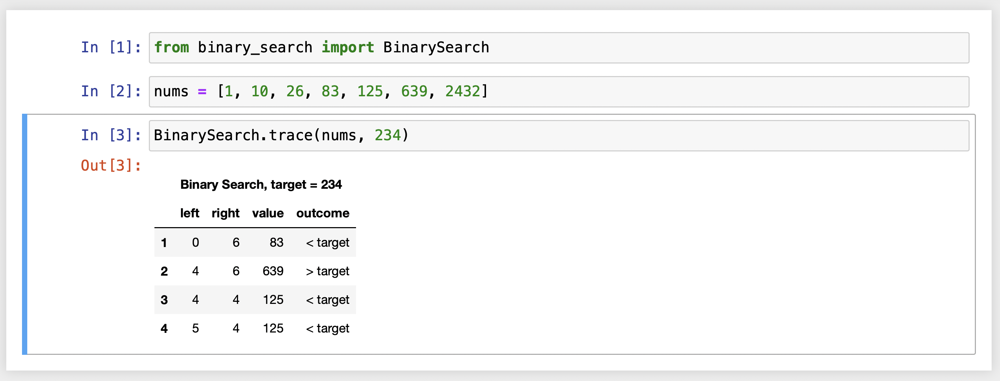

# BSearch Tracer

## What Is This?

The ``BinarySearch`` module's ``trace`` method tabulates what the binary search algorithm would do given a particular list of numbers and a specified target value.

## Demo

